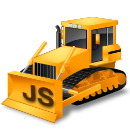

# DozerJS

Dozer is a system for rapidly developing services to support front-end applications.

It's not a framework, not a toolkit, rather Dozer aims to be a maleable and
unopinionated foundation for developing RESTful API's and web services to support
front-end development.

Dozer creates a cure server environment using [NodeJS](http://www.nodejs.org) and
the [Express framework](http://expressjs.com) then allows you to build api endpoints,
database schemas, and adapters which all work together to provide the services
required on the front-end.

## Core

The core of Dozer is the [Express](http://expressjs.com/) setup which sets a
number of common configuration properties, handles RESTful API endpoints and
serves static files. It then reads in the application configuration, loads any
adapters and builds the API endpoints.

## Adapters

Adapters are simply modules which are loaded and available throughout the application.
The can be database modules, express middleware or anything else required by the
application or any of the controllers.

## API

The API files establish the RESTful endpoints to which your server will respond.
They are objects where the top-level methods correspond with the HTTP verbs that
the endpoint will support (`GET`, `POST`, `PUT`, `DELETE`, etc).